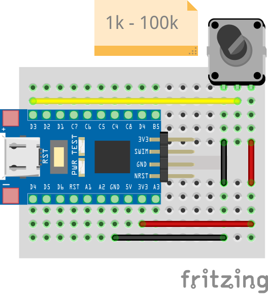

# ADC LED Threshold <!-- omit in toc -->

The following example enables the built-in LED on [this blue STM8S103F3 devboard](https://www.aliexpress.com/item/1005004514078858.html?spm=a2g0o.productlist.main.7.5b6f20c9INeEUu&algo_pvid=e4ea4e0a-c28e-4b91-895d-2a02f8af5d90&algo_exp_id=e4ea4e0a-c28e-4b91-895d-2a02f8af5d90-3&pdp_ext_f=%7B%22sku_id%22%3A%2212000029432042609%22%7D&pdp_npi=2%40dis%21EUR%211.31%211.31%21%21%21%21%21%40211bf3f116631655842315357d071d%2112000029432042609%21sea&curPageLogUid=TCv6XDktNh7d) once the ADC value has surpassed more than half of its max value. A potentiometer has been connected to the ADC pin, meaning that the LED will enable once the potentiometer has been rotated past its half point.

## Table of Contents <!-- omit in toc -->

- [Hardware Setup](#hardware-setup)
- [Software](#software)
	- [Configuration: src/stm8s_conf.h](#configuration-srcstm8s_confh)
	- [Main: src/main.c](#main-srcmainc)

## Hardware Setup

The following breadboard setup is used for this example:



The exact value of the potentiometer is not important for this example, since it is simply used as a voltage divider.

## Software

### Configuration: [src/stm8s_conf.h](src/stm8s_conf.h)

Since this example makes use of GPIOs and ADC1, we must uncomment the following modules in the configuration header:

```c
#include "stm8s_adc1.h"
#include "stm8s_gpio.h"
```

### Main: [src/main.c](src/main.c)

At the top of the main file we first define a few constants to make the code more readable:

```c
// Built-in LED
#define LED_BUILTIN_PORT GPIOB
#define LED_BUILTIN_PIN  GPIO_PIN_5

// Potentiometer
#define POT_GPIO_PORT GPIOD
#define POT_GPIO_PIN  GPIO_PIN_3
#define POT_ADC_CHANNEL ADC1_CHANNEL_4 // Channel 4 is connected to GPIO PD3 (See STM8CubeMX pinout for STM8S103F3Px)
#define POT_ADC_ADC_SCHMITTTRIG_CHANNEL ADC1_SCHMITTTRIG_CHANNEL4

#define MAX_ADC_VAL 1023 // Max value of 10 Bit ADC
```

Next, we enter the main function, which begins by initializing the GPIOs for the built-in LED, connected to pin `B5`, and the potentiometer, which is connected to pin `D3`:

```c
// Main routine
void main(void)
{
	// Initialize GPIOs
	GPIO_Init(LED_BUILTIN_PORT, LED_BUILTIN_PIN, GPIO_MODE_OUT_PP_LOW_FAST);  // Built-in LED: Output with push-pull, low level and 10MHz

	GPIO_Init(POT_GPIO_PORT, POT_GPIO_PIN, GPIO_MODE_IN_FL_NO_IT);		  // Potentiometer: Input with floating input and no interrupts
										  //                Floating input is recommended for ADC inputs by 
										  // 		    the STM8 reference manual (See section 11.7.3, Table 23)
```

The built-in LED pin is configured as output with push-pull driver and low state using the `GPIO_MODE_OUT_PP_LOW_FAST` mode.
The potentiometer pin is configured as input with floating input and no interrupts using the `GPIO_MODE_IN_FL_NO_IT` mode.
The floating input is recommended for ADC inputs by the STM8 reference manual. See section 11.7.3, Table 23 of the [STM8S reference manual](https://www.st.com/resource/en/reference_manual/cd00190271-stm8s-advanced-arm-based-8-bit-mcus-stmicroelectronics.pdf) for more information.

We then proceed to initialize the ADC1 peripheral:
```c
	// Initialize ADC1
	ADC1_Init(
		ADC1_CONVERSIONMODE_CONTINUOUS,  // Continuous conversion mode
		POT_ADC_CHANNEL,		 // Channel to convert
		ADC1_PRESSEL_FCPU_D2,		 // Prescaler: fCPU/2
		ADC1_EXTTRIG_GPIO,		 // External trigger: GPIO (Irrelevant, as we're disabling the trigger)
		DISABLE, 			 // Disable triggers
		ADC1_ALIGN_RIGHT,		 // ADC data alignment: Right (Lest significant 8 bits are in low register, most significant 2 bits in high register)
		POT_ADC_ADC_SCHMITTTRIG_CHANNEL, // Selects schmitt trigger for channel 4
		DISABLE				 // State to which selected schmitt trigger should be set to
						 // Disabling schmitt trigger is recommended by the STM8 reference manual (See section 11.7.3, Table 23)
	);
}
```

Let's go through all the arguments provided to the `ADC1_Init` function:

| Argument | Description |
| -------- | ----------- |
| `ADC1_CONVERSIONMODE_CONTINUOUS` | The ADC will run in continuous conversion mode, which means that the ADC will continuously convert the input voltage and store the result in the data registers.|
| `POT_ADC_CHANNEL` | The ADC channel to convert. `POT_ADC_CHANNEL` is defined as `ADC1_CHANNEL_4` at the top of the main file, which is connected to pin `D3` (See STM8CubeMX pinout for STM8S103F3Px).|
| `ADC1_PRESSEL_FCPU_D2` | The ADC clock prescaler. The ADC clock is derived from the CPU/master clock. In this case, the ADC clock will be `fCPU/2`, which is `2MHz/2 = 1MHz`, since the default speed of the master clock is 2MHz.|
| `ADC1_EXTTRIG_GPIO` | Lets us trigger the ADC through GPIOs, however, this argument is irrelevant in our example since we are not using external triggers (See next parameter). |
| `DISABLE` | Disables external triggers, thus making the previous argument useless. |
| `ADC1_ALIGN_RIGHT` | Stores least significant 8-bits of the 10-bit ADC value in the low ADC result register, and the most significant 2-bits in the high ADC result register. Aligning the ADC data right eases working with `ADC1_GetConversionValue()`. See section 24.8 of the [STM8S reference manual](https://www.st.com/resource/en/reference_manual/cd00190271-stm8s-advanced-arm-based-8-bit-mcus-stmicroelectronics.pdf) for more information about ADC data alignment. |
|`POT_ADC_ADC_SCHMITTTRIG_CHANNEL`|Selects schmitt trigger for the potentiometers GPIO. The schmitt trigger is disabled with the next argument.|
|`DISABLE`|Disables the schmitt trigger for the potentiometers GPIO. The schmitt trigger is recommended to be disabled by the STM8 reference manual (See section 11.7.3, Table 23).|


We then enable the ADC1 peripheral:
```c
	// Enable ADC1
	ADC1_Cmd(ENABLE);
```

And finally enter our main loop where we read the ADC value and set the built-in LED on or off depending on the ADC value:
```c
	uint16_t adc_val = 0; // Stores ADC value
	while(TRUE)
	{
		ADC1_StartConversion(); 				// Start conversion
		while(ADC1_GetFlagStatus(ADC1_FLAG_EOC) == !SET); 	// Wait for conversion to finish
		adc_val = ADC1_GetConversionValue(); 			// Get conversion value
		ADC1_ClearFlag(ADC1_FLAG_EOC); 				// Clear EOC (End-Of-Conversion) flag
		
		if (adc_val > MAX_ADC_VAL/2)					// Pot is above half way
			GPIO_WriteLow(LED_BUILTIN_PORT, LED_BUILTIN_PIN);	// Turn LED on
		else								// Pot is below half way
			GPIO_WriteHigh(LED_BUILTIN_PORT, LED_BUILTIN_PIN);	// Turn LED off
	}
}
```

We first tell the ADC to start conversion via the `ADC1_StartConversion()` function. This function will start the conversion process, but it will not wait for the conversion to finish. We then wait for the conversion to finish by checking the `ADC1_FLAG_EOC` (End-Of-Conversion) flag. The `ADC1_GetFlagStatus()` function will return `SET` once the ADC conversion has completed. We then get the conversion value using the `ADC1_GetConversionValue()` function. This function will return the 10-bit ADC value. We then clear the `ADC1_FLAG_EOC` flag using the `ADC1_ClearFlag()` function, so that we know when the next conversion has finished.

> Note: To my knowledege, it is actually not required to continously start the conversion process with `ADC1_StartConversion()`, as the ADC will automatically start a new conversion once the previous conversion has finished in continuous mode. That being said, the datasheet recommends setting the ADON bit (which is set by `ADC1_StartConversion`) after each conversion, even in continuous mode. See the timing diagrams in section 24.5.9 of the [STM8S reference manual](https://www.st.com/resource/en/reference_manual/cd00190271-stm8s-advanced-arm-based-8-bit-mcus-stmicroelectronics.pdf) for more information.

> Note: Checking and setting `ADC1_FLAG_EOC` is not strictly necessary, since the ADC will continue to convert the input voltage even if we don't check or set the flag. However, it is good practice to check the flag, since it will indicate whether the ADC value has been updated.

Finally, after reading the ADC value we then check if the ADC value is greater than half of its maximum value, and if it is, we turn the LED on. Otherwise we turn the LED off.