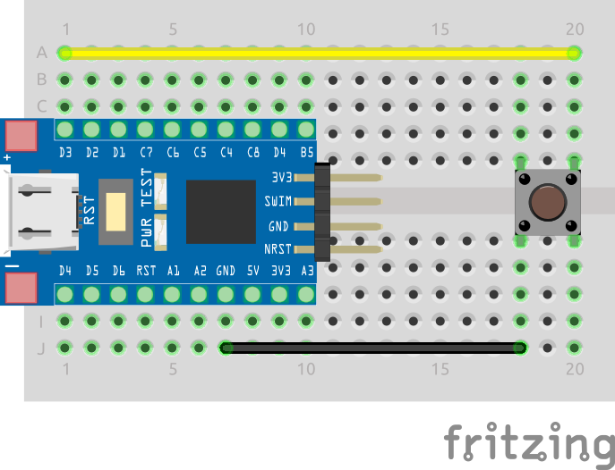

# Blink Button

The following example displays the state of a button on the built in LED of this [this blue STM8S103F3 devboard](https://www.aliexpress.com/item/1005004514078858.html?spm=a2g0o.productlist.main.7.5b6f20c9INeEUu&algo_pvid=e4ea4e0a-c28e-4b91-895d-2a02f8af5d90&algo_exp_id=e4ea4e0a-c28e-4b91-895d-2a02f8af5d90-3&pdp_ext_f=%7B%22sku_id%22%3A%2212000029432042609%22%7D&pdp_npi=2%40dis%21EUR%211.31%211.31%21%21%21%21%21%40211bf3f116631655842315357d071d%2112000029432042609%21sea&curPageLogUid=TCv6XDktNh7d).

## Table of Contents <!-- omit in toc -->


## Hardware Setup

The following breadboard setup is used for this example:



## Software

### Configuration: [src/stm8s_conf.h](src/stm8s_conf.h)

Since this example makes use of GPIOs, we must uncomment the GPIO module in the configuration header:

```c
#include "stm8s_gpio.h"
```

### Main: [src/main.c](src/main.c)

The `main` function initializes the GPIOs for the built-in LED, which is connected to pin `B5`, and the push button, which is connected to pin `D3`:

```c
	// Initialize GPIOs
	GPIO_Init(BTN_PORT, BTN_PIN, GPIO_MODE_IN_PU_NO_IT);
	GPIO_Init(LED_BUILTIN_PORT, LED_BUILTIN_PIN GPIO_MODE_OUT_PP_LOW_FAST); // Built-in LED, Output, Push Pull, Low
```

The push button pin is configured as input with pull-up resistor using the `GPIO_MODE_IN_PU_NO_IT` mode. The built-in LED pin is configured as output with push-pull driver and low state using the `GPIO_MODE_OUT_PP_LOW_FAST` mode.

The `main` function then enters an infinite loop, where it reads the state of the button and sets the state of the LED accordingly:

```c
	while(TRUE) {
		// Button released
		if (GPIO_ReadInputPin(BTN_PORT, BTN_PIN)) {
			GPIO_WriteHigh(LED_BUILTIN_PORT, LED_BUILTIN_PIN); // Turn off LED
		}
		// Button pressed
		else {
			GPIO_WriteLow(LED_BUILTIN_PORT, LED_BUILTIN_PIN); // Turn on LED
		}
	}
```

We do so by reading the state of the button pin using the `GPIO_ReadInputPin` function, and setting the state of the LED pin using the `GPIO_WriteHigh` and `GPIO_WriteLow` functions.

Note that a high level on the button pin means that the button is released, while a low level means that the button is pressed. This is due to the pull-up resistor on the button pin. Similarly, the built-in LED is turned on when the pin is set to low, and turned off when the pin is set to high due to the fact that the LED is configured as active low.
