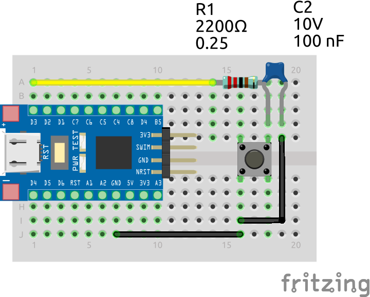

# External Interrupt Toggled LED <!-- omit in toc -->

The following example project toggles the bultin LED upon button release on [this blue STM8S103F3 devboard](https://www.aliexpress.com/item/1005004514078858.html?spm=a2g0o.productlist.main.7.5b6f20c9INeEUu&algo_pvid=e4ea4e0a-c28e-4b91-895d-2a02f8af5d90&algo_exp_id=e4ea4e0a-c28e-4b91-895d-2a02f8af5d90-3&pdp_ext_f=%7B%22sku_id%22%3A%2212000029432042609%22%7D&pdp_npi=2%40dis%21EUR%211.31%211.31%21%21%21%21%21%40211bf3f116631655842315357d071d%2112000029432042609%21sea&curPageLogUid=TCv6XDktNh7d).

## Table of Contents <!-- omit in toc -->

- [Hardware Setup](#hardware-setup)
- [Software](#software)
	- [Configuration: src/stm8s_conf.h](#configuration-srcstm8s_confh)
	- [Pins: src/pin.h](#pins-srcpinh)
	- [Interrupt Handler: stm8_it.c](#interrupt-handler-stm8_itc)
	- [Main: src/main.c](#main-srcmainc)

## Hardware Setup

The following breadboard setup is used for this example:



Since this example does not make use any software debouncing, a 2k2 resistor and the 100nf capacitor provide some hardware debouncing.
Not providing debouncing hardware may result in unstable/glitchy toggling of the built-in LED.

## Software

### Configuration: [src/stm8s_conf.h](src/stm8s_conf.h)

Since this example makes use of GPIOs and external interrupts, we must uncomment the following modules:

```c
#include "stm8s_exti.h"
#include "stm8s_gpio.h"
```

### Pins: [src/pin.h](include/pins.h)

The [`pins.h`](include/pins.h) header defines some preprocessors to address the button and LED GPIOs in more readable manner.

```c
// Built-in LED
#define LED_BUILTIN_PORT GPIOB
#define LED_BUILTIN_PIN  GPIO_PIN_5

// Push button
#define BUTTON_PORT GPIOD
#define BUTTON_PIN  GPIO_PIN_3
```

### Interrupt Handler: stm8_it.c

Since our button is attached to pin D3, the code to handle the interrupt must be placed in the `EXTI_PORTD_IRQHandler` handler:

```c
 /*
  * @brief External Interrupt PORTD Interrupt routine.
  * @param  None
  * @retval None
  */
INTERRUPT_HANDLER(EXTI_PORTD_IRQHandler, 6)
{
   GPIO_WriteReverse(LED_BUILTIN_PORT, LED_BUILTIN_PIN); // Toggle LED
   
   // Note that we're not performing any debouncing here. If you're using a
   // switch, you'll want to add some debouncing harware or add debouncing
   // code here. For the sake of simplicity, we're not doing that here.
}
```

Once the external interrupt is triggered, we toggle the built-in LED on and off using the `GPIO_WriteReverse` function.

### Main: [src/main.c](src/main.c)

The `main` function is responsible for setting up the GPIOs and external interrupts.

```c
void main(void)
{
	GPIO_Init(LED_BUILTIN_PORT, LED_BUILTIN_PIN, GPIO_MODE_OUT_PP_LOW_FAST); // Built-in LED
	GPIO_Init(BUTTON_PORT, BUTTON_PIN, GPIO_MODE_IN_PU_IT);			 // Push button, Pull-up, Interrupt enabled

	EXTI_SetExtIntSensitivity(EXTI_PORT_GPIOD, EXTI_SENSITIVITY_RISE_ONLY);	 // Set interrupt sensitivity of PORTD to rising edge (button released)
	enableInterrupts(); 							 // Enable interrupts

	while(TRUE);
}
```

First, we initialize the built-in LED as an output pin. Then, we initialize the push
button as an input pin, enable its internal pull-up resistor and enable the external interrupt for this pin.
We do this by providing the `GPIO_MODE_IN_PU_IT` mode to the `GPIO_Init` function.

Next, we set the interrupt sensitivity of the button to rising edge (button released) using the `EXTI_SetExtIntSensitivity` function.
We then enable interrupts using the `enableInterrupts` function and lastly enter an infinite loop awaiting interrupts.

Once the button is released, the `EXTI_PORTD_IRQHandler` is triggered and the built-in LED is toggled.
